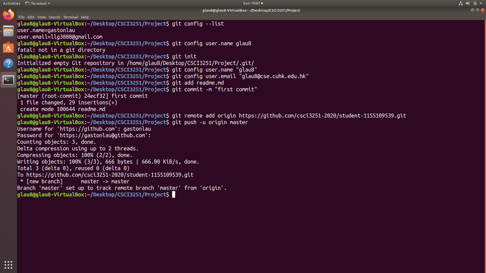

# CSCI3251 Github Project

### Name: Lau Gaston

**I am currently a Year 3 Computer Science student at The Chinese University of Hong Kong.**

Courses that I have completed
- [x] Data Structure
- [x] Introduction to Operating Systems
- [x] Design and Analysis of Algorithms
- [x] Introduction to Database Systems
- [x] Formal Languages and Automata Theory
- [ ] Artificial Intelligence
- [ ] Principles of Programming Languages
- [ ] Software Engineering
- [ ] Data Communication and Computer Networks

Experience in Github
* Group Project in CSCI3100 Software Engineering
* Group Assignment in CSCI4430 Data Communication and Computer Networks

Internship experience in KEEP
Task | Tools/Languages
------------ | -------------
Web crawling | Selenium, Python
Database management | MySQL, Python
Workflow design | Apache Airflow

